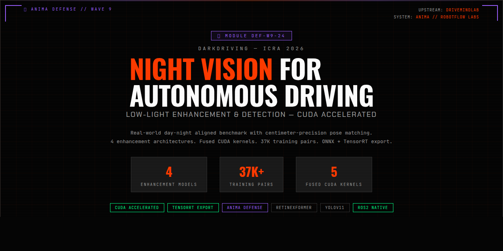

<p align="center">
  
</p>

# DarkDriving — Night Vision for Autonomous Driving

CUDA-accelerated low-light image enhancement benchmark for autonomous driving. Implements Retinexformer, SNR-Aware, LLFormer, and UNet enhancement architectures with downstream YOLOv11 detection evaluation.

**Paper**: [DarkDriving: A Real-World Day and Night Aligned Dataset for Autonomous Driving in the Dark Environment](https://arxiv.org/abs/2603.18067) (ICRA 2026)

## Capabilities

- 4 enhancement model architectures with model registry
- Fused CUDA kernels (preprocessing, augmentation, metrics)
- Multi-source training: nuScenes + KITTI synthetic day-night pairs (37K+)
- Full evaluation: PSNR, SSIM, LPIPS, MUSIQ, NIQE, AP50
- Export pipeline: PyTorch, SafeTensors, ONNX, TensorRT FP16/FP32
- Docker serving with ROS2 integration

## Quick Start

```bash
# Setup
uv venv .venv --python python3.11
source .venv/bin/activate
uv pip install torch torchvision torchaudio --index-url https://download.pytorch.org/whl/cu128
uv pip install -e .

# Train
CUDA_VISIBLE_DEVICES=0 python scripts/train_cuda.py --config configs/multi_source.toml

# Export
python scripts/export.py --config configs/multi_source.toml --checkpoint best.pth

# Evaluate
python scripts/evaluate.py --config configs/paper.toml --checkpoint best.pth
```

## Architecture

```
Night Image (512x512) -> Enhancement Model -> Enhanced Image -> YOLOv11 -> Detections
                              |                     |
                         Retinexformer          PSNR / SSIM / LPIPS
                         SNR-Aware              MUSIQ / NIQE
                         LLFormer               AP50 / AP50-90
                         UNet
```

## License

Research use. See [paper](https://arxiv.org/abs/2603.18067) for dataset terms.

---

<p align="center">
  <sub>ANIMA Defense Module // <a href="https://robotflow-labs.github.io">RobotFlow Labs</a></sub>
</p>
